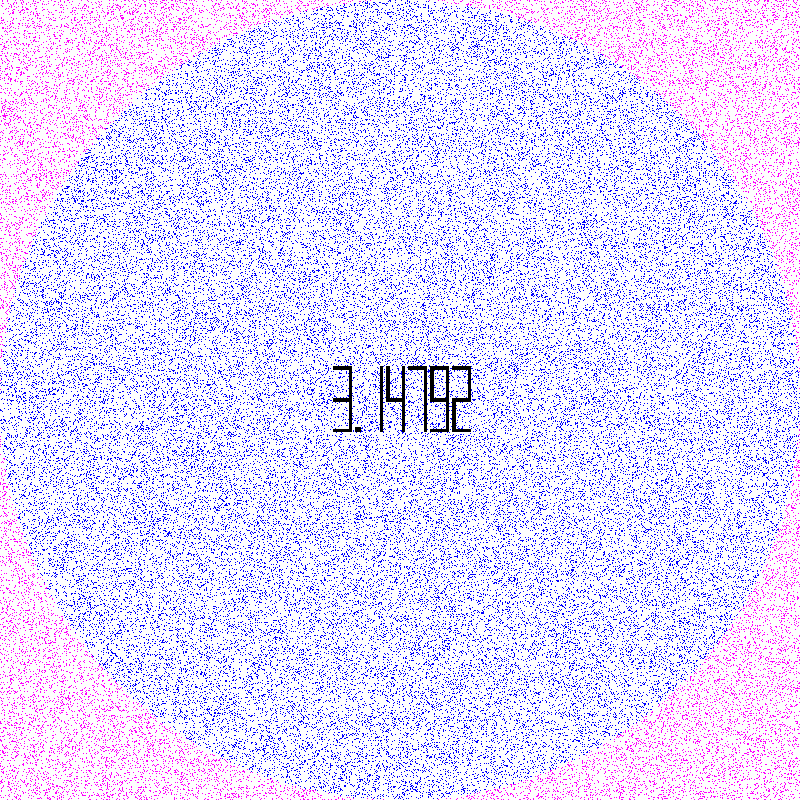

# Projet : **Approximation de π avec python:**

## 1. **Description:**

Le programme que vous allez écrire, qui se décomposera en deux fichiers Python, doit :

-   calculer une valeur approximative de π à l'aide d'une simulation de Monte-Carlo ;
-   générer une image animée représentant la simulation comme ci-dessous.



### 1.1 **Première partie : coeur de la simulation**

La première partie du projet consiste à écrire un module Python `approximate_pi.py` qui sera le coeur de notre simulation.
Autrement dit, ce module se charge uniquement du travail en lien avec le calcul d'une approximation de π sans se préoccuper des questions de visualisation sous forme d'image.

Le module `approximate_pi.py` doit fournir au programme `draw.py` décrit ci-dessous :

-   les points aléatoires tirés avec `x` appartenant à `[-1,1]` et `y` appartenant à `[-1,1]` pour tous les points ;
-   l'information indiquant si un point aléatoire est dans le cercle unitaire ou non.

Il est demandé que le module `approximate_pi.py` soit également un programme exécutable permettant de donner une approximation de π en utilisant un nombre de points donné sur la ligne de commande tel qu'illustré ci-dessous :

```console
./approximate_pi.py 100000000
3.14152532
```

### 1.2 Deuxième partie : génération d'images `PPM` puis d'un `GIF`

-   Nous allons maintenant utiliser `approximate_pi.py` comme un module pour passer aux choses sérieuses, c'est à dire à la génération de notre image animée représentant une simulation.

-   Le travail demandé consiste à écrire un programme Python `draw.py` qui :

    -   reçoit 3 arguments **dans l'ordre suivant** depuis la ligne de commande :

        -   la taille de l'image en pixels, qui est carrée donc un seul entier qui devra être supérieur ou égale à 100 ;
        -   le nombre de point `n` à utiliser dans la simulation, qui devra être supérieur à 100 ;
        -   le nombre de chiffres après la virgule à utiliser dans l'affichage de la valeur approximative de π, qui devra être compris entre 1 et 5.

-   implémente une fonction `generate_ppm_file(...)` qui génère une image au [format PPM](https://en.wikipedia.org/wiki/Netpbm#File_formats).

-   L'image doit montrer les points qui sont à l'intérieur du cercle d'une certaine couleur, les points qui sont à l'extérieur du cercle d'une autre couleur et la valeur approchée de π comme l'illustre l'image animée ci-dessus.
