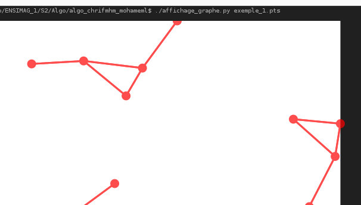
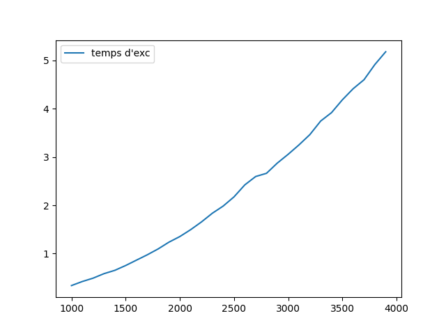

# Projet : **Identification de Composantes Connexes dans un Nuage de Points**

### 1. **Déscription:**

-   Ce projet porte sur l'identification de structures dans un nuage de points en fonction d'une distance seuil donnée. L'objectif est de transformer cet ensemble de points en un graphe non orienté, où les sommets représentent les points et les arêtes représentent les relations de proximité entre les points (deux points sont proches si leur distance est inférieure ou égale à un seuil spécifié). À partir de ce graphe, nous cherchons à identifier et dénombrer les composantes connexes, c'est-à-dire les sous-graphes dans lesquels tous les sommets sont reliés directement ou par transitivité. L'algorithme doit afficher les tailles des composantes connexes, de la plus grande à la plus petite, sous la forme d'une liste ordonnée.

### 2. **Démo:**

```bash
./main data/exemple_1.pts

```



-   **compléxite:**


