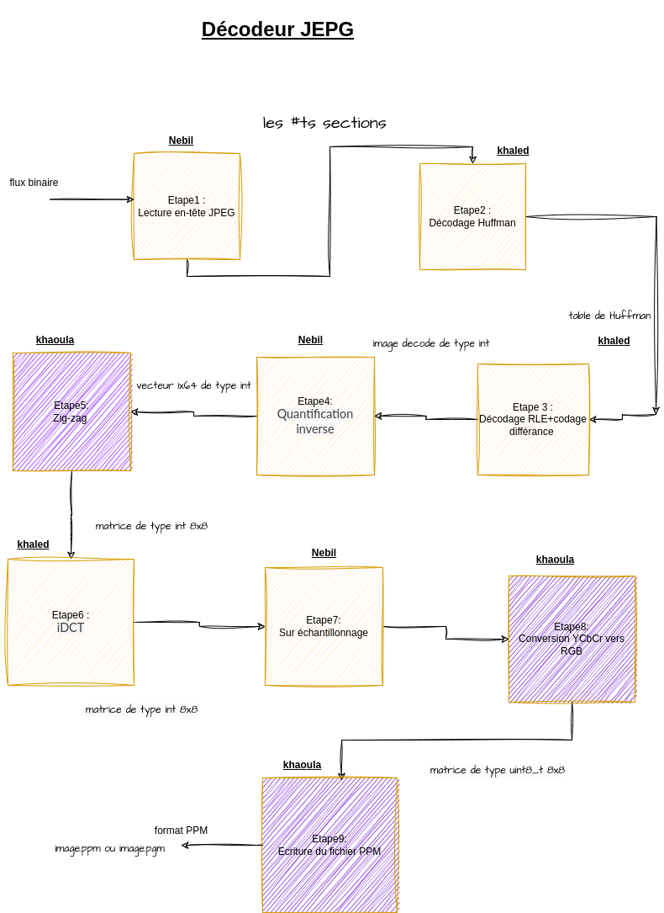

# Projet : **décodeur JPEG**

## 1. **Déscription:**

-   L'objectif de ce projet est de réaliser en langage C un décodeur qui convertit les images
    Format compressé (JPEG) en un format brut (PPM) **from scratch**

-   **Étapes de conversion :**



## 2. **Les differentes strucute et fonctions :**

```c

/* les structures utilises :   */

/* ----------------------------tab_chaine-------------------------------------- */
/*ceci est un module : tableaux des chaines qui s'appelle : tab_chaine */

typedef struct tab_chaine
{
    int taille ; /* represente la taille de tab */
    char** pointeur ; /* represente le pointeur vers le premier case  de la tableaux  */

}tab_chaine;

extern void  ajouter_chaine(tab_chaine* p,char* chaine);
extern void liberer_tab_chaine(tab_chaine* p);
extern void afficher_tab_chaine(tab_chaine tab);


/* MODULE : MATRICE CARRE */

typedef struct matrice
{
    int taille_ligne ; /* represente le nombres des lignes  */
    int taille_colone ; /* represente le nombre des colones */
    uint8_t** pointeur ; /* represente le pointeur vers le premier case  de la tableaux  */

}matrice;


extern void initialiser_matrice(matrice* p , int taille_mat_ligne , int taille_mat_colone );
extern void ajouter_elem(matrice* p,uint8_t elem , int indice_i , int indice_j );
extern void ajouter_ligne (matrice* p,int* ligne ,int taille_ligne , int indice_ligne );
extern void liberer_matrice(matrice* p);
extern void afficher_matrice(matrice mat);
extern void ajouter_ligne_uint8_t (matrice* p,uint8_t* ligne ,int taille_ligne , int indice_ligne );


/*------------------ bloc_8_fois_8 --------------------------*/
typedef struct bloc_8_fois_8
{
    int position_x ;
    int position_y ;
    int data_mat[8][8];
    int data_vect_64[64];


}bloc_8_fois_8;

/*---------------- MCU_BLOC ------------------*/
/* struct MCU_BLOC : pour stocker tout l'image dans une liste chaine*/
typedef struct MCU_BLOC
{

    bloc_8_fois_8 bloc;
    struct MCU_BLOC* suiv;

}MCU_BLOC;


/*------- Operations de MCU ------------------*/

extern void inserer_mcu(MCU_BLOC** pl, bloc_8_fois_8 bloc);
extern void supprimer_dernier_mcu(MCU_BLOC** pl);
extern void liberer_mcu(MCU_BLOC** pl);
extern  void afficher_MCU(MCU_BLOC* pl);
/*--------------- Operations de bloc_8_fois_8 ---------------*/

extern void afficher_data_vect_bloc_8_fois_8(bloc_8_fois_8 bloc );
extern void afficher_data_mat_bloc_8_fois_8(bloc_8_fois_8 bloc );


/*-------- structure mcu_vect -------------*/

typedef struct mcu_vect
{
    MCU_BLOC *data_vect_Y;
    MCU_BLOC *data_vect_Cb;
    MCU_BLOC *data_vect_Cr;

} mcu_vect;


/*-------------  struct mcu_mat   --------------*/

typedef struct mcu_mat
{
    matrice data_Y;
    matrice data_Cb;
    matrice data_Cr;
}
mcu_mat;


/*-------------- structure liste_chaine_mcu : pour stocker tout le mcu dans une liste_chaine ------------ */

typedef struct liste_chaine_mcu
{
    mcu_mat data;
    struct liste_chaine_mcu  *suiv;
} liste_chaine_mcu;

void inserer_liste_chaine_mcu(liste_chaine_mcu** pl, mcu_mat mcu);
void supprimer_dernier_liste_chaine_mcu(liste_chaine_mcu** pl);
void liberer_liste_chaine_mcu(liste_chaine_mcu** pl);
void afficher_liste_chaine_mcu(liste_chaine_mcu* pl);

/* -------------------------------MODULE:Lecture_en_tete------------------------------*/


void  redriction_entete_jpeg(FILE* fichier,char* nom_fich);
void lectrue_section_SOFO(FILE* fichier, char* octet,tab_chaine* p_SOFO ,tab_chaine* p_SOS,tab_chaine* p_APP0,tab_chaine* p_DQT,tab_chaine* p_DHT,tab_chaine* p_COM);
void lectrue_section_SOS(FILE* fichier, char* octet,tab_chaine* p_SOFO ,tab_chaine* p_SOS,tab_chaine* p_APP0,tab_chaine* p_DQT,tab_chaine* p_DHT,tab_chaine* p_COM);
void lectrue_section_APPO(FILE* fichier, char* octet,tab_chaine* p_SOFO ,tab_chaine* p_SOS,tab_chaine* p_APP0,tab_chaine* p_DQT,tab_chaine* p_DHT,tab_chaine* p_COM);
void lectrue_section_DQT(FILE* fichier, char* octet,tab_chaine* p_SOFO ,tab_chaine* p_SOS,tab_chaine* p_APP0,tab_chaine* p_DQT,tab_chaine* p_DHT,tab_chaine* p_COM);
void lectrue_section_DHT(FILE* fichier, char* octet,tab_chaine* p_SOFO ,tab_chaine* p_SOS,tab_chaine* p_APP0,tab_chaine* p_DQT,tab_chaine* p_DHT,tab_chaine* p_COM);
void  lectrue_section_COM(FILE* fichier, char* octet,tab_chaine* p_SOFO ,tab_chaine* p_SOS,tab_chaine* p_APP0,tab_chaine* p_DQT,tab_chaine* p_DHT, tab_chaine* p_COM);
int valide_section(char* octet);
void extraction_sections(FILE* fichier,char* octet,tab_chaine* p_SOFO,tab_chaine* p_SOS,tab_chaine* p_APP0,tab_chaine* p_DQT,tab_chaine* p_DHT,tab_chaine* p_COM);
void octet_suivant(char* octet,FILE* fichier);


tab_chaine taille_image(tab_chaine SOFO);
tab_chaine extraction_image(tab_chaine SOS  );
tab_chaine extracte_info_composante(char* composant , tab_chaine SOFO);
char*  extracte_indice_huffman(char* composante , tab_chaine SOS , tab_chaine SOFO);
int nombres_composantes(tab_chaine SOFO);
tab_chaine extracte_tab_huffamn(char* composante , char* type , tab_chaine DHT , tab_chaine SOS , tab_chaine SOFO);
tab_chaine  exctracte_table_quantification(char* composante , tab_chaine DQT , tab_chaine SOFO);
tab_chaine order_appartion_comp(tab_chaine SOFO, tab_chaine SOS);
int nb_appration_bloc_8_fois_8_dans_mcu(char *composante, tab_chaine SOFO);


char* concatenation(char* chaine1 , char* chaine2);


/* --------------------------------Module : Decodage_Huffman------------------------------------- */
uint8_t somme_bin(uint8_t a,uint8_t b);
void code_bin(uint8_t val,uint8_t taille,char* tab);
tab_chaine decodage_tab_huffman(tab_chaine tab_huffman );

char* transformatin_image_en_binnaire(tab_chaine image);

void avance_chaine(char** chaine, char elem );
int valide_magnitude(char* chaine , tab_chaine tab_huffman );
int indice_magnitude(char* chaine , tab_chaine tab_huffman);
int decode_val_exacte(char** chaine);
void bar(char** chaine);
void decodage_RLE(char* image_bin_AC,tab_chaine tab_huffman_AC, int tableau_des_val_AC[], int* indice , int* compteur);
void decodage_image_Huffman(char* image_en_bin, tab_chaine tab_huffman_DC , tab_chaine tab_huffman_AC, int image_decode[]);
void decodage_Huffman_mcu(mcu_vect *mcu_flux, char *image_en_bin, tab_chaine tab_Huffman_Y_DC, tab_chaine tab_Huffman_Y_AC, tab_chaine tab_Huffman_Cb_Cr_DC, tab_chaine tab_Huffman_Cb_Cr_AC, tab_chaine SOS, tab_chaine SOFO, int *compteur, int *DC_precedent_Y, int *DC_precedent_Cb, int *DC_precednt_Cr);


uint8_t convert_octet_to_uint8_t(char* octet);
uint16_t convert_bin_to_uint16_t(char* octet);
uint8_t convert_nibble_to_uint8_t(char lettre);
uint16_t convert_octet_to_uint16_t(char* octet);

/*-----------------------  MODULE : IDCT  -----------------------*/

/*----------------------  IDCT ------------------------*/
float c(uint8_t  val);
void idct( int mat_entree[8][8], int matrice_sortie[8][8]);

/*----------------------- IDCT_RAPIDE -------------------------------*/

void Rotation(float x, float y, float k, uint8_t n, float *z, float *t);
float* loeffler(float* stage_4, float res[8]);
void idct_rapide( int inp[8][8], int out[8][8]);


/*------------------ MODULE : Quantification Inverse : -----------------------------*/
void quantification_inverse(int tab[64], tab_chaine tab_quantification);

/* ------------------------------- Zig_Zag_inverse --------------------------------------------------*/
void zig_zag_inverse(int tab[64], int mat[8][8]);

/*---------------------------------  sur_echantillonnage-------------------------------------------------*/
void data_vect_vers_data_mat(mcu_vect mcu_flux, mcu_mat *mcu, tab_chaine SOFO);
void  sur_echantiollnnage(mcu_mat* ptr_mcu);

/*---------------------------------------------------- YCbCr vers RGB ---------------------------------------------- */
void YCbCr_RGB(mcu_mat mcu);

/*-------------------------- MODULE : DECODEUR_BASELINE -------------------------------- */

void decodeur_baseline(char* nom_fichier);
char* recupere_nom_ppm(char* nom_fichier , int nb_comp);
void remplissage_image(MCU_BLOC** image, int largeur_image , int hauteur_image , char* image_en_bin ,tab_chaine decode_huffman_Y_DC , tab_chaine  decode_huffman_Y_AC ,int* DC_precedent,  int* compteur,tab_chaine tab_quantification_Y);
void traite_bloc(bloc_8_fois_8* bloc , char* image_en_bin, tab_chaine decode_huffman_Y_DC ,tab_chaine decode_huffman_Y_AC ,int* DC_precedent, int* compteur, tab_chaine tab_quant);

void traite_mcu(liste_chaine_mcu** image, mcu_vect *mcu_flux, char *image_en_bin, tab_chaine tab_Hufffman_Y_DC, tab_chaine tab_Hufffman_Y_AC, tab_chaine tab_Hufffman_Cb_Cr_DC, tab_chaine tab_Hufffman_Cb_Cr_AC, tab_chaine SOS, tab_chaine SOFO, int *compteur, int *DC_precedent_Y, int *DC_prcedent_Cb, int *DC_precednt_Cr, tab_chaine tab_quant_Y, tab_chaine tab_quant_Cb_Cr);

void remplissage_image_couleur(FILE* fichier ,liste_chaine_mcu** image, int largeur_image , int hauteur_image , char* image_en_bin ,tab_chaine decode_huffman_Y_DC , tab_chaine  decode_huffman_Y_AC , tab_chaine deocde_huffman_Cb_Cr_DC , tab_chaine deocde_huffman_Cb_Cr_AC ,     int* DC_precedant_Y , int *DC_precedant_Cb ,int* DC_precedant_Cr ,  int* compteur ,tab_chaine tab_quant_Y , tab_chaine tab_quant_Cb_Cr , tab_chaine SOFO , tab_chaine SOS );


```
