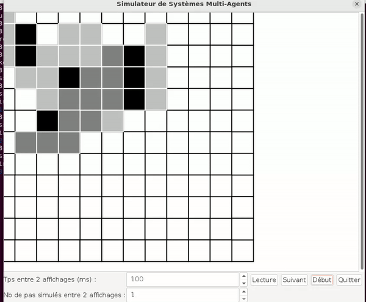
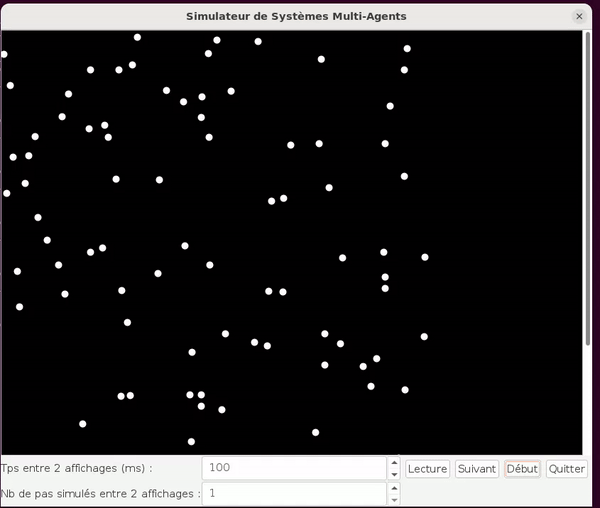

# projet : **"Simulation de Systèmes Multiagents : Automates Cellulaires et Modèle de Boids en Java"**

## 1. **Description:**

-   Ce projet vise à développer une application en Java pour simuler graphiquement divers systèmes multiagents.

-   Il comprend la simulation de trois automates cellulaires : le jeu de la vie de Conway, un jeu d'immigration, et le modèle de ségrégation de Schelling. Par la suite, l’application s’étendra à la simulation du modèle de Boids, représentant le mouvement d'essaims auto-organisés. Le projet mettra en pratique les concepts fondamentaux de la programmation orientée objet (POO), tels que l'encapsulation, l'héritage, et l'abstraction, tout en cherchant à généraliser le code pour différents systèmes multiagents.

## 2. **lancer le Test :**

pour lancer le Test il suffit de tapez la commnade **`make <nom de Test >`** dans le répertoire **code** .

-   pour la Simulation de Balles : **`make runTestBallesSimulator`**

-   pour le jeu de la vie (Jeu Conway) : **`make runTestJeuConWay`**

-   pour le jeu de l’immigration : **`make runTestJeuImmigration`**

-   pour la simulation du modèle de Schelling : **`make runTestSchelling`**

-   pour la simulation de boids : **`make runTestBoids`**

-   pour la simulation de la classe Event :**`make runTestEvent`**

## 3. **Démo:**

-   **jeu de la vie:**

-   **simulation de boids:**

