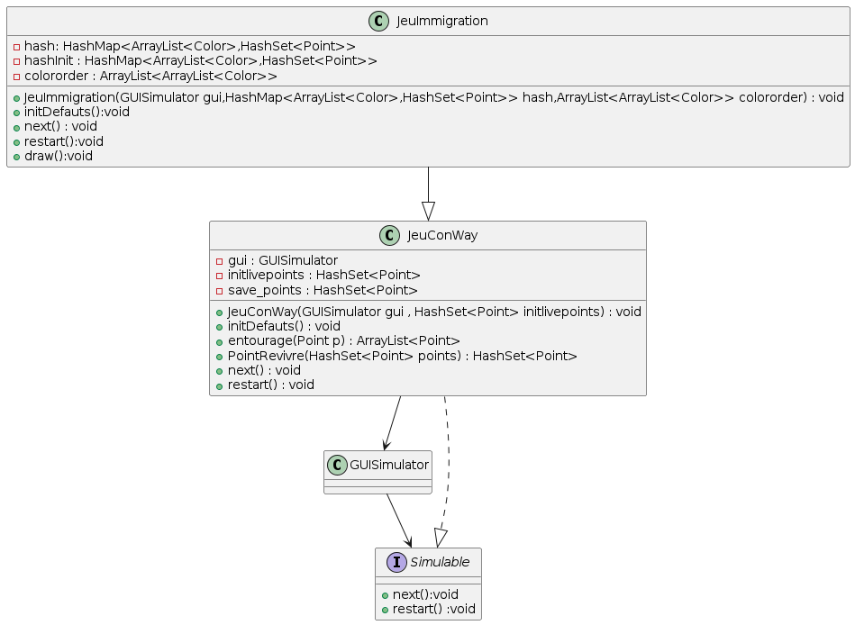
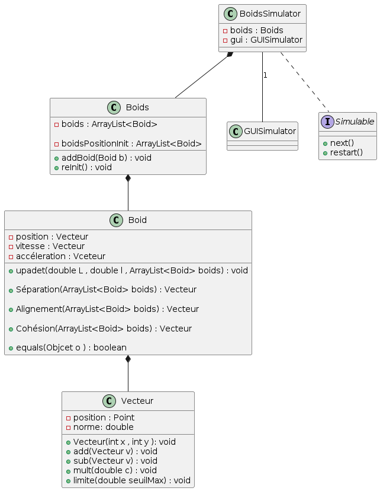

# Rendu du projete : Simulation multi-agents 

## 1. **lancer le Test :**

pour lancer le Test il suffit de tapez la commnade **``make <nom de Test >``** dans le répertoire **code** .

- pour la Simulation de Balles : **`make runTestBallesSimulator`**

- pour le jeu de la vie (Jeu Conway) : **`make runTestJeuConWay`**

- pour le jeu de l’immigration : **`make runTestJeuImmigration`**

- pour la simulation du  modèle de Schelling : **`make runTestSchelling`**

- pour la simulation de boids : **`make runTestBoids`**

## 2. -**le Jeu de la vie: Jeu Conway**

- Elle contient trois attributs :
        
    - ``protected GUISimulator gui``  : pour lancer la simulation 

    - ``private HashSet<Point> initlivepoints = new HashSet<>():`` pour initialiser les points vivant au début , dans TestJeuConway j'ai testé avec l'exemple de l'énoncé, et j'ai mis en commentaire quelques d'autres exemples.

    - ``private HashSet<Point> save_points = new HashSet<>():`` pour garder les points vivavnts au cours du temps  et le reste des points sont morts .

- Elle contient aussi plusieurs fonction :

    - ``JeuConWay(GUISimulator gui , HashSet<Point> initlivepoints) :`` crér l'objet et lance la simulation puis on remplit save_points par une copie indépendante de initlivepoints.

    
    - ``initDefauts() :`` pour afficher l'affichage initiale et rempli savePoint par les valeurs initiales en utilisant hashInit.

    
    - ``entourage(Point p) :`` cette fonction donne une ArrayList qui contient les 8 points qui entoure p en tenant compte des conditions de bordure.

    
    - `` PointRevivre(HashSet<Point> points) :`` elle parcour les points morts qui entourent les points vivre (c'est à dire qui ont la possibilité de revivre) et elle appelle entourage sur ces points et vérifie les conditions du jeu pour fournir enfin un HashSet<Point> qui contient les points à revivre.

    - ``void next()`` : appelle toutes les fonctions qui en aura besoin, et elle parcour les savePoints, elle appelle entourage sur ces points et tue un point sui doit être tué, et ajoute dans "HashSet<Point> points_possible_revivre " les points morte qui entoure un point vivant, pour appeler enfin PointRevivre(HashSet<Point> points) sur ces points.

    - ``void restart() :`` elle appelle initDefauts()

## 3. **le Jeu de l’immigration:**

- C'est une extension de la classe JeuConWay

- Elle contient trois attributs en plus :
    
    - ``private HashMap<ArrayList<Color>,HashSet<Point>> hash`` :  ``ArrayList<Color>`` contient deux couleurs, en indice 0 :couleur interieur de la case, et en indice 1: couleur des frontières et ``HashSet<Point>``: contient les points correspondants à cette couleur, En effet j'ai considéré les couleurs comme des clés, dont les valeurs sont des points de la même couleur

    - private HashMap<ArrayList<Color>,HashSet<Point>> hashInit = new HashMap<>() :pour garder les valeurs initiales de hash
    
    ArrayList<ArrayList<Color>> colororder = new ArrayList<>() : Elle contient les couleurs dans l'ordres proposés par l'utilisateur

    J'ai initialisé hash dans TestJeuImmigration par les même valeurs que dans l'exemple de l'énoncé

    Elle utilise quelques fonctions héritée de la classe JeuConWay et elle redefinie des autres aussi de cette classe.

    Pour définir un objet on utilise :
    
    - JeuImmigration(GUISimulator gui , HashMap<ArrayList<Color>,HashSet<Point>> hash, ArrayList<ArrayList<Color>> colororder): qui prend en paramétre le HashMap initiale = hash , et l'orde des couleurs =colororder , elle lance la simulation et elle rempli hasInit par une copie indépendante de hash pour garder les caleurs initiales, et elle fait appelle à initDefauts().

    - void initDefauts() : elle affiche l'affichage initiale et rempli hash par les valeurs initiales en utilisant hashInit.

    - void next() : elle parcour toutes les clés et leurs valeurs dans hash, verifie si une valeur doit rester ou doit être transformer déplacer aux valeurs d'une autre clé, puis à la fin elle trace l'image resultante.

    - void restart() : appelle initDéfauts()

    - void draw() : dessine l'image resultante en utilisant hash

## 4. **le modèle de Schelling:**

- La grille est représentée comme un tableau bidimensionnel de cellules, chaque cellule étant une instance de la classe Cell.
Cette représentation permet d'encapsuler l'état et les comportements de chaque agent de manière individuelle.

Le tableau bidimensionnel reflète intuitivement l'espace physique de la grille. L'accès aux cellules dans un tableau bidimensionnel est réalisé en temps constant O(1).
Dans notre simulation, chaque étape nécessite de parcourir et de mettre à jour de nombreuses cellules, un accès rapide est essentiel pour maintenir une exécution fluide.

  Le modèle de Schelling repose fortement sur l'interaction entre cellules voisines.
Avec un tableau bidimensionnel, il est simple de parcourir les voisins d'une cellule donnée en utilisant des décalages d'indices.
De cette manière, on garantit aussi une allocation de mémoire cohérente.
Dans notre code, cela signifie que les cellules adjacentes dans la grille sont également proches en mémoire, ce qui optimise les performances d'accès.

- Choix de la Classe `Cell` : Chaque cellule peut être habitée par un agent ou être vacante. 
En définissant une classe pour ces cellules, nous encapsulons non seulement leur état – occupée ou non, couleur de l'agent – mais aussi les comportements associés – par exemple, le changement de couleur ou la vérification de l'état occupé. Ceci rend notre code plus lisible et facilite la gestion des états des cellules.

- Gestion de la Simulation avec `SchellingSimulator` : SchellingSimulator est une classe qui implémente l'interface `Simulable`, fournissant les méthodes next et restart pour progresser ou réinitialiser la simulation.
Ceci nous permet de séparer la logique de la simulation de l'affichage graphique, rendant le code plus modulaire et plus facile à maintenir.
Cette manière de représenter permet de rajouter facilement de nouvelles règles ou comportements d'agents.
## 5. **Simulation de Boids:**

- **diagramme UML:**

- **expliquation de choix:**

- **classe ``Vecteur``:**

    - Cette classe `Vecteur` représente un vecteur bidimensionnel en utilisant les coordonnées x et y. 
    
    - Elle inclut également des opérations courantes sur les vecteurs comme :  `add(Vecteur v)` , `sub(Vecteur v)`  , `mult(double c)`  , `limite(double seuilMax)`.

    - Le choix de cette classe vise à ajouter des fonctionnalités telles que `add`, `sub`, `mult`, etc., afin d'éviter la redondance dans le code.

- **classe `Boid`:**
            

    - Cette classe `Boid` représente un agent (ou boid) dans un système simulant le comportement de foule ou d'essaim. 
    
    - Chaque `Boid` possède une position, une vitesse et une accélération, représentées par des objets de la classe `Vecteur`. 
    
    
    - La classe fournit également plusieurs méthodes pour mettre à jour le comportement du boid en fonction de ses voisins dans le système :

        - **Méthode `Séparation(ArrayList<Boid> boids)` : les agents trop proches se repoussent, pour éviter les collisions**
        
        - **Méthode `Alignement(ArrayList<Boid> boids)` : un agent tend à se déplacer dans la même direction que ses voisins**

        - **Méthode `Cohésion(ArrayList<Boid> boids)` :Cohésion un agent se dirige vers la position moyenne (centre de masse) des ses voisins**

- **classe `BoidsSimulator`:**

    - La classe `BoidsSimulator` est conçue pour simuler le comportement des Boids.
    
    - Possède deux attributs, `Boids boids` et `GUISimulator gui`.

    - La classe `BoidsSimulator` implémente l'interface `Simulable` et possède donc deux méthodes, `next()` et `restart()`.