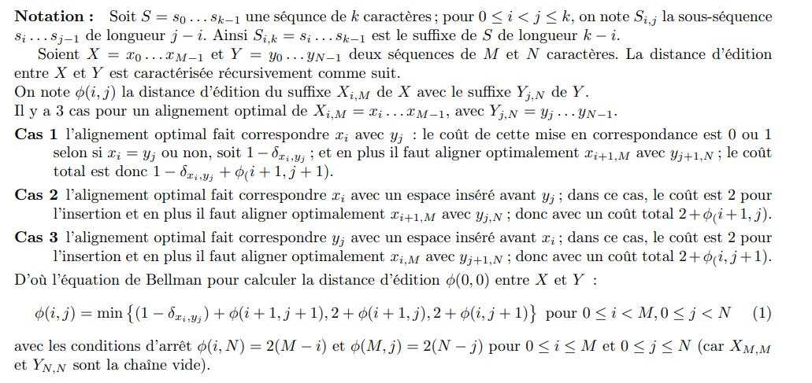

# Projet : **Alignement de séquences génétiques**

## 1. L'objectif :

-   Le but de ce projet est d’écrire un programme `cache oblivious` qui calcule l’alignement global optimal de
    deux séquences génétiques (ADN) et d’analyser ses défauts de cache.

-   Ce calcul est réalisé par programmation dynamique (algorithme de Needleman-Wunsch).

## 2. Introduction à sujet :

### 2.1 Séquence génétique :

-   chaque séquenec génetique contient :

    -   l’adenine (A),
    -   la cytosine (C),
    -   la guanine (G),
    -   la thymine (T) ,
    -   l’uracile (U) .

-   étant donée un séquence d'ADN ` A A C A G T T A C C` l'objectif est de comparer la séquenec avec des séquences déja étuide par exemple ` T A A G G T C A`

-   Si les deux séquences génétiques sont suffisamment similaires, on pourrait s’attendre à ce qu’elles aient des fonctions similaires.

-   Une des méthodes utilisées pour mesurer la similarité de deux séquences génétiques est leur `distance d’édition` .

### 2.2 Distance d’édition :

-   **a.Principe de calcul de distance d'édition :**

-   Il s’agit d’aligner les deux séquences, i.e. les rendre égales, en s’autorisant :

    -   à changer des caractères (en substituant un caractère par un autre dans une séquence)

    -   à insérer des espaces dans l’une ou l’autre (par exemple, pour qu’elles aient la même longueur).

    -   Un coût est payé pour chaque espace inséré et également pour chaque paire de caractères qui ne correspondent pas dans l’alignement final. :
        -   insérer un espace : cout = 2
        -   aligner deux caractères qui ne correspondent pas : cout = 1
        -   aligner deux caractères qui correspondent : cout = 0

-   _La distance d’édition :_ est le coût minimal parmi tous les alignements possibles entre deux séquences.

### 2.3 Caractérisation récursive de la distance d’édition :



### 2.4 Implémentation récursive de la distance d’édition

-   Le programme `distanceEdition.c` fourni est une implémentation récursive avec mémoïsation de cette équation de Bellman

```shell
make

./distanceEdition file1 b1 L1 file2 b2 L2


```

-   Entrée :

    -   deux noms de fichers de caractères file1 (contenant la séquence X) et file2 (contenant Y )

    -   suivi de deux entiers b1 , L1 et b2 , L2 ;

-   Sortie :

    -   il affiche sur la sortie standard la distance d’édition entre $X_{b1 ,b1 +L1 −1}$ et $Y_{b2 ,b2 +L2 −1}$ (i.e. commençant au caractère bk de filek et de longueur Lk pour k = 1, 2).
