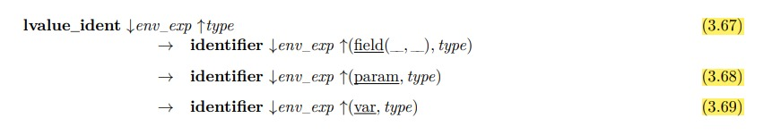

# Erreurs étape B :

## 1. Règles communes aux trois passes de vérifications contextuelles :

- **Règle (0.1):**
    
    
     
    - raison : opération partielle  env_exp(name)
    - message : « identificateur non déclaré »

- **Règle (0.2) :**

    
     
    
    - raison : opération partielle env_types(name)
    - message : « identificateur de type non déclaré »

## 2. Grammaire attribuée spécifiant la passe 1:

- **Règle (1.3) :** 

    
     

    - raison : opération paratielle [L’identificateur super doit être un identificateur de classe préalablement déclaré]
    - message : "identificateur non déclaré "

    - raison : condition 
    - message : " identificateur de classe attendu"

    - raison : opération union disjointe 
    - message : "classe ou type déjà déclaré "

### 3. Grammaire attribuée spécifiant la passe 2 :

- **Règle (2.3) :** 

    
     
    
    - raison : opération partielle env_types(super)
    - message : "en fait erreur interne : on doit pas arriver ici "

    - raison : condition 
    - message : " identificateur de classe attendu"

    - raison : opération partielle union disjointe
    - message : "un nom de méthode redéclare un nom de champ "

- **Règle (2.4) :** 

    
     

    - raison : opération partielle union disjointe .
    - message : "nom d’attribut déjà déclaré ".

- **Règle (2.5) :** 
    
    
     

    - raison : condition type != void .
    - message : "le type attendu doit étre différent de void".

    - raison : condition et opération partielle env_types(super)
    - message : "en fait erreur interne : on doit pas arriver ici "

    - raison :si le champ est deja définir dans le super class ---> elle doit étre de type field 
    - message : "le  type attendu est field "

- **Règle (2.6) :** 

    
     

    - raison : opération partielle union disjointe 
    - message : "méthode déja déclaré".

- **Règle (2.7) :** 

    
     

    - raison : condition et opération partielle env_types(super)
    - message : "en fait erreur interne : on doit pas arriver ici "

    - raison : condition 
    - message : " identificateur de classe attendu"

    - Si une méthode est redéfinie alors :
        
        - raison : sig = sig2;
        - message : "une méthode redéfinie doit avoire la méme signature"

        - raison : subtype(env_types, type, type2)
        - message : "une méthode redéfinie doit avoir pour type de retour un sous-type du type de retour de la méthode héritée"

- **Règle (2.9) :** 

    
     

    -  raison :type != void
    - message : "le type attendu doit étre différent de void"

### 4. Grammaire attribuée spécifiant la passe 3 :

- **Règle (3.5) :** 

    
     

    - raison : opération partielle env_types(super)
    - message : "en fait erreur interne : on doit pas arriver ici "

    - raison : condition 
    - message : " identificateur de classe attendu"

- **Règle (3.12) :** 

    
     
    - raison : opération union disjointe env_expr ⊕ env_exp
    - message : " paramètre deja déclarée "

- **Règle (3.17) :** 

    
     

    - raison :  opération union disjointe
    - message : " variable  deja déclarée "

    - raison : condition type != void 
    - message : "le type attendu doit étre différent de void"

    
- **Règle (3.24) :** 

    
     

    - raison : condition return != void 
    - message : " paramètre deja déclarée "

- **Règle (3.28) :** 

    
     

    - raison : condition assign_compatible(env_types, type1, type2)
    - message : "cette affection n'est pas cohérente "

- **Règle (3.29) :** 

    
     

    - raison : Filtrage d’un attribut synthétisé en partie droite : doit étre boolean .
    - message : "type attendu est boolean".

- **Règle (3.31) :** 

    
     

    - raison : condition type = int ou type = float ou type = string
    - message : "le type attendu int , float , string "

- **Règle (3.39) :** 

    
     
    - raison : condition cast_compatible(env_types, type2, type)
    - message : "casting non compatible "

- **Règle (3.42) :** 

    
     

    - raison : condition type = type_class(__)
    - message : "le type attendu : type_class"

- **Règle (3.43) :** 
    
    
     

    - raison : condition class!=0
    - "class non définie"

- **Règle (3.65) :** 

    
     

    - raison : opération partielle env_types(class2)
    - message : "en fait erreur interne : on doit pas arriver ici "
    
    - raison : condition 
    - message : " identificateur de classe attendu"

    - raison : Filtrage d’un attribut synthétisé en partie droite: field_ident ↓env_exp2 ↑public ↑__ ↑type
    - message : "accès pas possible : doit étre public "

- **Règle (3.66) :**

    
     

    - raison : opération partielle env_types(class2)
    - message : "en fait erreur interne : on doit pas arriver ici "
    
    - raison : condition 
    - message : " identificateur de classe attendu"

    - raison : Filtrage d’un attribut synthétisé en partie droite: field_ident ↓env_exp2 ↑protected ↑class_field ↑type
    - message : "visibilité attendu : protected "

    - raison : subtype(env_types,type_class(class2),type_class(class))
    - message : "le type de class2 doit étre un sous type de classe"

    - raison : subtype(env_types,type_class(class),type_class(class_field))
    - message : "le type de class doit étre un sous de type de class field "

- **Règle (3.67) , (3.68) , (3.69) :**

    
     
    - raison : Filtrage d’un attribut synthétisé en partie droite
    - message :"nature attendu : champ , paramètre , varibale  

- **Règle (3.70) :**

    
     
    - raison : Filtrage d’un attribut synthétisé en partie droite
    - message : "type attendu : field "

- **Règle (3.71) :**

    
     
    - raison : opération partielle env_types(class2)
    - message : "en fait erreur interne : on doit pas arriver ici "
    
    - raison : condition 
    - message : " identificateur de classe attendu"

- **Règle (3.72) :**

    
     

    - raison : Filtrage d’un attribut synthétisé en partie droite
    - message : "type attendu : méthode "

- **Règle (3.73) :**

    
     
    - raison : Filtrage d’un attribut hérité en partie gauche
    - message : "signature attendu : []"
