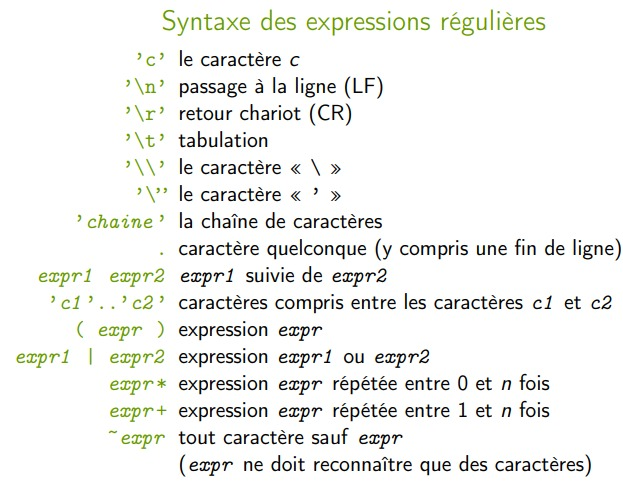

# ANTLR : ANother Tool for Language Recognition

## 1. Introduction :

- **ANTLR** permet de générer des reconnaisseurs pour des langages :
   - **analyseurs lexicaux** (« lexer » en anglais),
   - **analyseurs syntaxiques** (« parser » en anglais).


## 2. **Structure d’un fichier source ANTLR:**


### 2.1 **En-tête ANTLR :**

- C'est la première section du fichier source.

- Elle contient des déclarations telles que les options globales pour ANTLR, les importations de code, et d'autres configurations.


- **Analyseur lexical :**

    ```g4
    lexer grammar nomDeClasse ;
    ```
    L’analyseur lexical généré est une classe de nom nomDeClasse ;

- **Analyseur syntaxique :**
    ```g4
    parser grammar nomDeClasse ;
    ```
    L’analyseur syntaxique sera une classe de nom nomDeClasse ;

- **options:**

    ```g4
    options {
    nom-option = valeur;
    nom-option2 = valeur2 ;
    ...
    }

    ```
    - parmi les noms des options possibles :
        
        - **language :** le langage de programmation (défaut : Java)
        - **superClass :** le code généré est une classe qui hérite de cette classe
        - **tokenVocab :** le vocabulaire d’entrée à utiliser (le nom de l’analyseur lexical dans le cas d’un analyseur syntaxique)
    
    - exemple :

        ```g4
        parser grammar DecaParser;

        options {

            language  = Java;

            superClass = AbstractDecaParser;

            tokenVocab = DecaLexer;

        }

        ```


- **@header:** 

    - Portion de code (Java) ajouté en tête du fichier généré.
     
    - Exemple :
        ```g4
        @header {
        import nom.du.paquetage ;
        }        
        ```
- **@members:** 

    - Portion de code (Java) ajoutée dans la classe générée.

    - Peut être utilisé pour ajouter des champs et des méthodes dans la classe générée.

    ```g4
    @members { ... }
    
    ```

### 2.2 **Règles du Lexer (pour Analyseur Lexical) :**

- Cette section définit les règles pour analyser les caractères d'entrée en jetons (tokens).

- **Une règle** 
    - est de la forme : **``NOM_REGLE : expression-régulière;``** (Le nom de la règle doit commencer par une majuscule).

    - Exemple : 
    ```g4
    PLUS : ’+’;

    ```

    - Lorsque l’expression régulière est reconnue, un jeton correspondant au nom de la règle est renvoyé.

- **jeton:**

    - est un objet de type **``org.antlr.runtime.Token``**.

    - ``PLUS``: [@6,13:13=’+’,<45>,1:13]
        - 6 : 6ème jeton reconnu
        - 13:13 : la chaîne ’+’ commence au 13ème caractère du fichier source, et se termine sur ce même 13ème caractère.
        - <45> : code du jeton
        - 1 : numéro de ligne
        - 13 : numéro de colonne


- **Action associée à une règle:**

    - Portion de code Java qui est effectuée avant de renvoyer le jeton.

    - **``NOM_REGLE : expression-régulière { action } ;``**

    - Exemple :

    ```g4
    ESPACE : ’ ’ { System.out.println("espace reconnu"); };
    ```

- **Fonction utile :**

    - **skip():** Permet de ne pas renvoyer le jeton correspondant : ``ESPACE : ’ ’ { skip(); } ;``

    - **getText() :** Permet de récupérer le texte source correspondant

- **Fragment de règle:**

    -  règle qui peut être utilisée dans d’autres règles, et ne produisant pas de jeton (macros)

    - exemple :

    ```g4
    
    fragment CHIFFRE : ’0’ .. ’9’;
    NOMBRE : CHIFFRE+;
    
    ```

- **Syntaxe des expressions régulières:**




- **Principe de la plus longue correspondanc:**
 
    - Pour chaque règle, l’analyseur lexical tente de reconnaître la chaîne la plus longue possible.

    - Si deux règles peuvent s’appliquer pour reconnaître deux chaînes de la même longueur : la première règle est prioritaire.

- **régle DEFAULT:**

```g4
DEFAULT : .;

```
en fin de fichier pour reconnaître « tous les autres caractères ».

- **Traitement des commentaires Deca:**

```g4
COMMENT : ’/*’ .*? ’*/’ { skip(); } ;

```

