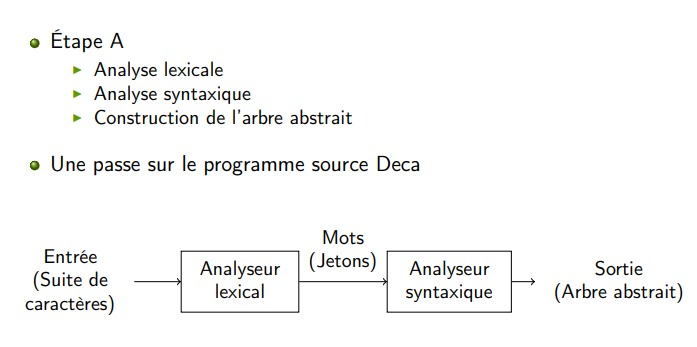
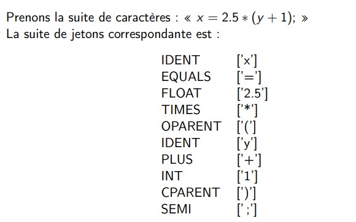
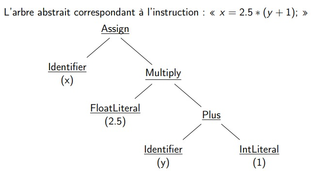
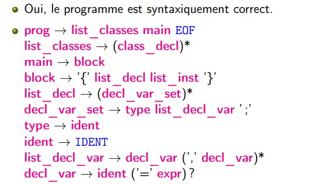
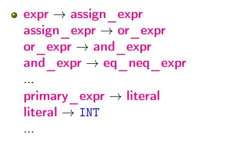

# étape A :

## 1. Introduction :

- **Vue d’ensemble de l’étape A:**



- **Analyse lexicale:**

    - Partitionner une suite de caractères ( programme source en Deca) en une suite de mots ( unité lexicale).
    - à chaque unité lexicale est associé : un **``jeton``** ou **``token``**  .

    


- **Analyse syntaxique:**

    - L’analyse syntaxique permet de déterminer si une suite de mots est une phrase du langage.<br>
         ⇒ Est-ce qu’une suite de jetons correspond à un programme Deca syntaxiquement correct ?
    - **Outil:**
        - **La grammaire hors-contexte** définit la syntaxe concrète du langage Deca (cf. II-[Syntaxe])

- **L’arbre abstrait est :**

    - une représentation structurée du programme Deca ;
    - construit lors de l’analyse syntaxique.

    
 

## 2. **Analyse lexicale:**


- La lexicographie de Deca décrit l’ensemble des mots du langage Deca.

- Description complète : II-[Lexicographie]

- consulter aussi [ANTLR](antlr.md)

- **Travail à réaliser pour l’analyse lexical:**
    - Compléter le fichier : **``src/main/antlr4/fr/ensimag/deca/syntax/DecaLexer.g4``**

    -  L’inclusion de fichier est traitée en analyse lexicale.(Utiliser la méthode ``doInclude`` de ``AbstractDecaLexer.java``)

    - Utiliser le script ``test_lex`` pour faire des tests


## 3. **Analyse syntaxique: Arbre abstrait**

### 3.1 **Syntaxe:**

- La syntaxe concrète de Deca décrit l’ensemble des phrases (ou programmes) correctes du langage Deca .

- Description complète de la syntaxe : grammaire de Deca cf. II-[Syntaxe].

- **Exemple:**

Le programme Deca est-il syntaxiquement correct ?

```java
{
    int i = 1;
    println(i, " : ok");
}

```





### 3.2 **Arbre abstrait :**

- Arbre abstrait : représentation structurée du programme Deca 

- Les constructions d’arbres sont décrites par une grammaire d’arbres, définit la syntaxique abstraite du langage Deca.

- Référence : II-[SyntaxeAbstraite]


