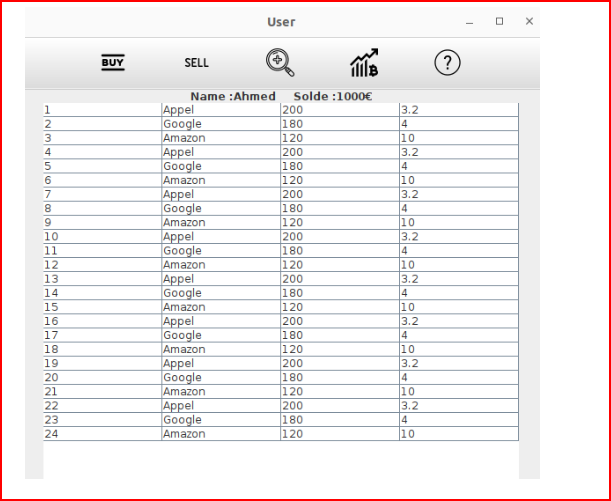

# Projet : **Analyse et Conception d'un jeu de simulation boursière**

## 1. **Description:**

-   Ce projet a pour objectif de réaliser l'analyse et la conception orientée objet d'un jeu de simulation boursière.

-   L'application permettra aux utilisateurs d'effectuer des opérations boursières telles que l'achat et la vente d'actions, tout en gérant un portefeuille virtuel.

-   Le projet met l'accent sur la modélisation des entités et des relations du monde financier, offrant une interface interactive pour simuler des transactions et suivre les performances des investissements, tout en appliquant les concepts clés de la programmation orientée objet.

## 3. **Démo:**

```
make
make run
```


