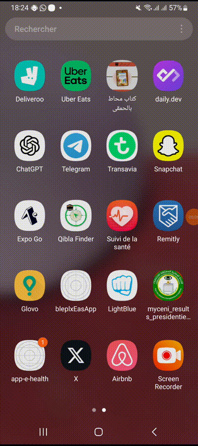

# Projet : **"Développement d'une Application Mobile e-Health avec React Native et Dispositifs Bluetooth Connectés"**

## 1. **Description :**

-   Ce projet consiste à concevoir et développer une application mobile de santé (e-Health) avec React Native, permettant aux utilisateurs de surveiller et de gérer leurs données de santé via des dispositifs connectés utilisant la technologie Bluetooth.

-   L'application proposera un tableau de bord personnalisé affichant en temps réel des données telles que la fréquence cardiaque, la tension artérielle et le niveau de glucose, avec des graphiques pour suivre les tendances.

-   Les utilisateurs pourront appairer et gérer leurs dispositifs de santé connectés, stocker localement leurs données, et recevoir des notifications et alertes personnalisées en fonction de seuils prédéfinis.

-   Ce projet mettra en oeuvre des technologies modernes telles que React Native, Bluetooth Low Energy (BLE), Firebase pour le backend .

## 2. **Démo:**

