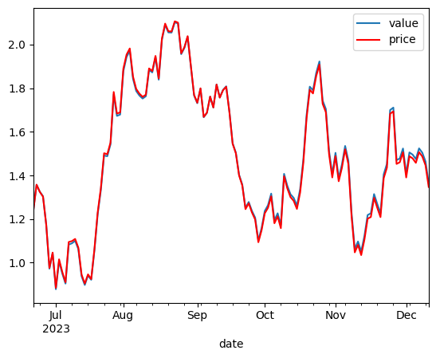

# Projet : **Développement d'une Application de Tests de Stratégies Systématiques pour Portefeuilles de Couverture avec .NET**

## 1. **Description:**

-   Ce projet consiste à développer une application financière utilisant le framework .NET, destinée à servir d'outil d'aide à la décision pour réaliser des tests de validation (forward et backtests) sur des portefeuilles de couverture d'options.

-   L'application sera conçue en C# et intégrera des fonctionnalités permettant d'évaluer la performance d'un portefeuille composé d'actifs sous-jacents et de taux sans risque.

-   Elle inclura également le calcul du payoff associé à des options de type panier, facilitant ainsi l'analyse des stratégies systématiques de couverture.

-   Ce projet offre une opportunité d'explorer les technologies modernes de développement logiciel et d'acquérir une compréhension approfondie des principes de la finance quantitative.

## 2. **Démo:**

```bash
BacktestConsole.exe test-params.json mkt-data.csv output-file.json

```

```python

# fonction de test :
def test(chemin):
    # lectur de données :
    df = pd.read_json(chemin, convert_dates=['date'])
    df.sort_values(by='date', inplace=True)
    df.set_index('date', inplace=True)

    # plot :
    ax = plt.gca()
    df.plot(y = 'value', ax = ax)
    df.plot(y = 'price', color = 'red', ax = ax)
    plt.show()

    # calcul : tracking_error
    tracking_error = (df['value'][-1] - df.price[-1])/df.price[0]
    print(f'Tracking error: {tracking_error:.2%}')

    return tracking_error

test(output-file.json)

```


