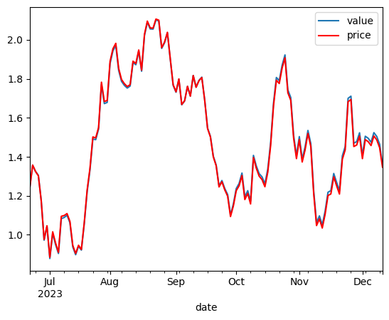

# Systematic Strategies — .NET Forward/Backtest Library for Hedging Portfolios

## 1. Description

- A financial application built with the **.NET framework**, designed as a decision-support tool for running **forward and backtests** on option hedging portfolios.
- Developed in **C#**, the application evaluates the performance of a hedging portfolio composed of underlying assets and the risk-free rate.
- Includes **basket option payoff computation**, enabling analysis of systematic hedging strategies (self-financing portfolio, rebalancing oracle).
- The project provides hands-on experience with modern software development practices and core quantitative finance principles.

## 2. Demo

### Run a backtest

```bash
BacktestConsole.exe test-params.json mkt-data.csv output-file.json
```

### Analyze results

```python
def test(path):
    # Load data
    df = pd.read_json(path, convert_dates=['date'])
    df.sort_values(by='date', inplace=True)
    df.set_index('date', inplace=True)

    # Plot hedging portfolio value vs. theoretical price
    ax = plt.gca()
    df.plot(y='value', ax=ax)
    df.plot(y='price', color='red', ax=ax)
    plt.show()

    # Compute tracking error
    tracking_error = (df['value'][-1] - df.price[-1]) / df.price[0]
    print(f'Tracking error: {tracking_error:.2%}')
    return tracking_error

test("output-file.json")
```



## Tech Stack

- **C# / .NET** — Core application
- **NUnit** — Unit testing
- **LINQ** — Data handling
- **gRPC** — Communication with pricing server
- **Python** — Result analysis and visualization

## Academic Context

Project completed at **ENSIMAG, Grenoble INP** as part of the Quantitative Finance specialization (MEQA), 2024–2025.
